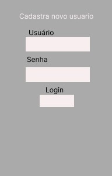

# agendaeltronica
O aplicativo de notas é uma dessas ferramentas que permitirá ao usuário criar, organizar e acompanhar suas tarefas diárias.

# Diagrama de Implantação

Este documento descreve como criar um diagrama de implantação para um sistema web utilizando SQLite3 e Streamlit.

## Componentes Principais do Sistema

1. **Client**: O navegador web que o usuário usará para acessar o sistema.
2. **Web Server**: O servidor que hospeda o aplicativo Streamlit.
3. **Database Server**: O servidor que hospeda o banco de dados SQLite3. Note que, no caso do SQLite, o banco de dados geralmente reside no mesmo servidor que o aplicativo, já que é um banco de dados embutido.

## Arquitetura de Implantação

1. **Navegador do Usuário (Client)**: O usuário acessa o sistema através de um navegador web.
2. **Servidor de Aplicações (Web Server)**: Hospeda o aplicativo Streamlit.
3. **Banco de Dados (Database)**: O banco de dados SQLite3 reside no mesmo servidor que o aplicativo Streamlit.

Exemplo de Diagrama de Implantação
## Imagens

### Diagrama de Implantação
 )

Descrição do Diagrama
User's Browser (Navegador do Usuário):
O usuário acessa a aplicação Streamlit através do navegador.
Web Server (Servidor de Aplicações):
O servidor onde a aplicação Streamlit está hospedada. Ele processa as requisições dos usuários, executa a lógica da aplicação e interage com o banco de dados SQLite3.
SQLite3 DB:
Banco de dados embutido dentro do servidor de aplicações. Armazena informações dos usuários e os compromissos agendados.

## AppListaDeTarefa

O AppListaDeTarefa é um aplicativo de notas desenvolvido em Python, usando Streamlit e SQLite3. Este aplicativo permite aos usuários criar, organizar e acompanhar suas tarefas diárias de maneira eficiente.

Objetivos

Objetivo Geral
Oferecer ao usuário um sistema que contribua para guardar informações para serem utilizadas no dia a dia de forma prática.

## Objetivos Específicos
- Fazer anotações de informações de forma rápida
- Consultar informações rapidamente
- Otimizar o tempo
- Evitar perda de informações
- Organizar informações
- Guardar dados

## Funcionalidades

- Adicionar novas notas
- Visualizar notas existentes
- Editar notas
- Excluir notas

## Instalação

## Siga os passos abaixo para instalar e executar o aplicativo em seu ambiente local:

1. Clone o repositório
    bash
    git clone https://github.com/moisesmania/agendaeltronica.git
    cd app-lista-de-tarefa
    

2. Crie um ambiente virtual
    bash
    python -m venv venv
    source venv/bin/activate  # No Windows, use `venv\Scripts\activate`
    

3. Instale as dependências
    bash
    pip install -r requirements.txt
    

4. Execute o aplicativo
    bash
    streamlit run app.py
    

## Como Usar

Adicionar uma Nova Nota
1. Abra o aplicativo.
2. Clique em "Adicionar Nota".
3. Insira o título e o conteúdo da nota.
4. Clique em "Salvar".

## Visualizar Notas Existentes
1. Na página inicial, você verá uma lista de todas as suas notas.
2. Clique em qualquer nota para visualizá-la em detalhes.

## Editar uma Nota
1. Clique na nota que deseja editar.
2. Clique em "Editar".
3. Modifique o título e/ou o conteúdo da nota.
4. Clique em "Salvar".

## Excluir uma Nota
1. Clique na nota que deseja excluir.
2. Clique em "Excluir".
3. Confirme a exclusão.

## Contribuição

Sinta-se à vontade para contribuir com o projeto! Você pode fazer isso de várias maneiras:

1. Reportando bugs e solicitando novas funcionalidades através de issues.
2. Enviando pull requests para correções de bugs ou novas funcionalidades.

## Licença

Este projeto está licenciado sob a [MIT License](LICENSE).

---

## Imagens

### Tela Inicial rascuho
.jpg>))

### Adicionar rascunho
 )

### Tela Inicial
 )

### Adicionar Nota
   

### Visualizar Nota
 )

### Edicionar , ecluir , ler , editar
 )

 
 

